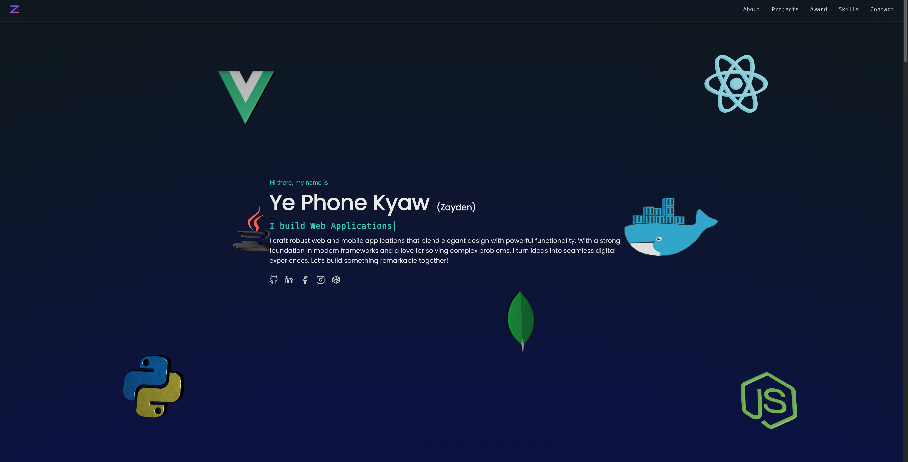

# ✨ Personal Portfolio v2

A modern, interactive portfolio website built with Next.js 15, featuring stunning animations, glassmorphism design, and smooth user experiences.



## 🚀 Features

- **Modern Design System**
  - Glassmorphism UI with backdrop blur effects
  - Smooth GSAP scroll-triggered animations
  - Responsive design for all screen sizes
  - Dark theme with gradient backgrounds

- **Interactive Components**
  - Animated navigation with hide-on-scroll
  - 3D hero section with Three.js
  - Project carousel with center mode
  - Smooth scroll navigation
  - Dynamic typing animations

- **Sections**
  - Hero with animated 3D elements
  - About with skill cards
  - Projects showcase with slider
  - Awards & achievements
  - Technical skills
  - Contact form

## 🛠️ Tech Stack

**Framework & Libraries**
- [Next.js 15](https://nextjs.org/) - React framework
- [React 19](https://react.dev/) - UI library
- [Tailwind CSS](https://tailwindcss.com/) - Styling

**Animations & 3D**
- [GSAP](https://gsap.com/) - Professional-grade animations
- [Three.js](https://threejs.org/) - 3D graphics
- [Framer Motion](https://www.framer.com/motion/) - React animations
- [React Type Animation](https://www.npmjs.com/package/react-type-animation) - Typing effects

**UI Components**
- [React Slick](https://react-slick.neostack.com/) - Carousel/slider
- [React Scroll](https://www.npmjs.com/package/react-scroll) - Smooth scrolling
- [React Icons](https://react-icons.github.io/react-icons/) - Icon library
- [Heroicons](https://heroicons.com/) - Beautiful icons

## 📦 Installation

1. Clone the repository:
```bash
git clone https://github.com/yourusername/portfolio-v2.git
cd portfolio-v2
```

2. Install dependencies:
```bash
npm install
```

3. Run the development server:
```bash
npm run dev
```

4. Open [http://localhost:3000](http://localhost:3000) in your browser.

## 🎨 Project Structure

```
src/
├── app/
│   ├── constants/          # Navigation links, projects data
│   ├── pages/              # Page sections
│   │   ├── Hero.jsx
│   │   ├── About.jsx
│   │   ├── Projects.jsx
│   │   ├── Awards.jsx
│   │   ├── Skills.jsx
│   │   └── Contact.jsx
│   ├── globals.css         # Global styles & animations
│   └── page.jsx            # Main layout
├── components/
│   ├── Navbar.jsx          # Animated navigation
│   ├── Button.jsx          # Reusable button component
│   ├── ProjectCard.jsx     # Project display cards
│   ├── TextCard.jsx        # Skill/info cards
│   └── icons/              # Custom icon components
└── fonts/
    └── fonts.js            # Custom font configurations
```

## 🎯 Key Features Explained

### Glassmorphism Design
Modern glass-effect UI with:
- `backdrop-blur-xl` for frosted glass effect
- Semi-transparent backgrounds (`bg-white/5`)
- Subtle borders with opacity
- Smooth hover transitions

### Scroll Animations
Powered by GSAP ScrollTrigger:
- Elements fade in as you scroll
- Staggered animations for lists
- Parallax effects
- Smooth reveal animations

### Responsive Navigation
- Desktop: Fixed navbar with smooth hide/show on scroll
- Mobile: Glassmorphic dropdown with animated hamburger menu
- Active section highlighting

## 🚀 Build & Deploy

### Build for production:
```bash
npm run build
```

### Start production server:
```bash
npm start
```

### Deploy to Vercel:
[](https://vercel.com/new/clone?repository-url=https://github.com/yourusername/portfolio-v2)

Or manually:
1. Push your code to GitHub
2. Import project to [Vercel](https://vercel.com)
3. Deploy with one click

## 📝 Customization

### Update Personal Info
Edit `src/app/constants/index.js`:
- Navigation links
- Project details
- Skills & technologies
- Contact information

### Modify Animations
Adjust GSAP animations in individual page components:
```javascript
useGSAP(() => {
  gsap.from('.element', {
    opacity: 0,
    y: 50,
    duration: 1,
    scrollTrigger: {
      trigger: '.element',
      start: 'top center',
    }
  });
});
```

### Change Theme Colors
Update Tailwind colors in components or `tailwind.config.mjs`:
- Primary: `teal-300`, `teal-400`, `teal-500`
- Background: Dark gradient (defined in `globals.css`)
- Glass: `white/5`, `white/10`, `backdrop-blur-xl`

## 📄 License

This project is open source and available under the [MIT License](LICENSE).

## 🤝 Contributing

Contributions, issues, and feature requests are welcome!

## 📧 Contact

Feel free to reach out for collaborations or questions!

---

**Built with ❤️ using Next.js and modern web technologies**
